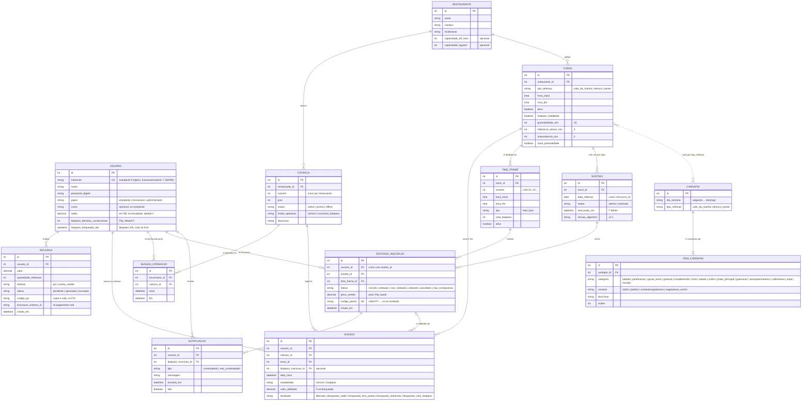

# Modelo Entidade-Relacionamento — UnB RU

```mermaid
erDiagram
    USUARIO ||--o{ RECARGA : realiza
    USUARIO ||--o{ ACESSO : "passa na catraca"
    USUARIO ||--o{ SESSAO_OPERACAO : "inicia (funcionario)"
    USUARIO ||--o{ FASTPASS_INSCRICAO : "se inscreve"
    USUARIO ||--o{ NOTIFICACAO : recebe
    RESTAURANTE ||--o{ CATRACA : possui
    RESTAURANTE ||--o{ TURNO : define
    CATRACA ||--o{ SESSAO_OPERACAO : "é operada em"
    CATRACA ||--o{ ACESSO : registra
    TURNO ||--o{ ACESSO : "ocorre em"
    TURNO ||--o{ TIME_FRAME : "é dividido em"
    TURNO ||--o{ SORTEIO : "tem um por data"
    TURNO }o..o{ CARDAPIO : "casa por tipo_refeicao"
    CARDAPIO ||--|{ ITEM_CARDAPIO : "é composto por"
    SORTEIO ||--o{ FASTPASS_INSCRICAO : reúne
    TIME_FRAME ||--o{ FASTPASS_INSCRICAO : recebe
    FASTPASS_INSCRICAO ||--o{ NOTIFICACAO : gera
    FASTPASS_INSCRICAO |o--o{ ACESSO : "é validada em"

    USUARIO {
        int id PK
        string matricula UK "estudante 9 digitos, funcionario/admin 7 (SIAPE)"
        string nome
        string password_digest
        string papel "estudante | funcionario | administrador"
        string curso "opcional, so estudante"
        decimal saldo "em R$, so estudante, default 0"
        int fastpass_derrotas_consecutivas "Pity, default 0"
        datetime fastpass_bloqueado_ate "bloqueio 24h, nulo se livre"
    }
    RECARGA {
        int id PK
        int usuario_id FK
        decimal valor
        int quantidade_refeicoes
        string metodo "pix | cartao_credito"
        string status "pendente | aprovada | recusada"
        string codigo_pix "copia e cola, so PIX"
        string transacao_externa_id "se pagamento real"
        datetime criado_em
    }
    RESTAURANTE {
        int id PK
        string nome
        string campus
        string localizacao
        int capacidade_ref_hora "opcional"
        int capacidade_lugares "opcional"
    }
    CATRACA {
        int id PK
        int restaurante_id FK
        int numero "unico por restaurante"
        int piso
        string status "online | pronta | offline"
        string modo_operacao "comum | exclusivo_fastpass"
        string descricao
    }
    SESSAO_OPERACAO {
        int id PK
        int funcionario_id FK
        int catraca_id FK
        datetime inicio
        datetime fim
    }
    TURNO {
        int id PK
        int restaurante_id FK
        string tipo_refeicao "cafe_da_manha | almoco | jantar"
        time hora_inicio
        time hora_fim
        boolean ativo
        boolean fastpass_habilitado
        int granularidade_min "15"
        int tolerancia_atraso_min "3"
        int antecedencia_min "2"
        boolean trava_pontualidade
    }
    TIME_FRAME {
        int id PK
        int turno_id FK
        int numero "Lote 01, 02..."
        time hora_inicio
        time hora_fim
        string tipo "lote | pico"
        int cota_fastpass
        boolean ativo
    }
    SORTEIO {
        int id PK
        int turno_id FK
        date data_refeicao "unico com turno_id"
        string status "aberto | realizado"
        datetime executado_em "T-60min"
        string versao_algoritmo "v2.1"
    }
    FASTPASS_INSCRICAO {
        int id PK
        int usuario_id FK "unico com sorteio_id"
        int sorteio_id FK
        int time_frame_id FK
        string status "inscrito | sorteado | nao_sorteado | utilizado | cancelado | nao_compareceu"
        decimal peso_sorteio "peso Pity usado"
        string codigo_passe UK "UNB-FP-..., so se sorteado"
        datetime criado_em
    }
    ACESSO {
        int id PK
        int usuario_id FK
        int catraca_id FK
        int turno_id FK
        int fastpass_inscricao_id FK "opcional"
        datetime data_hora
        string modalidade "comum | fastpass"
        decimal valor_debitado "0 se bloqueado"
        string resultado "liberado | bloqueado_saldo | bloqueado_fora_janela | bloqueado_reentrada | bloqueado_sem_fastpass"
    }
    NOTIFICACAO {
        int id PK
        int usuario_id FK
        int fastpass_inscricao_id FK
        string tipo "contemplado | nao_contemplado"
        string mensagem
        datetime enviada_em
        boolean lida
    }
    CARDAPIO {
        int id PK
        string dia_semana "segunda ... domingo"
        string tipo_refeicao "cafe_da_manha | almoco | jantar"
    }
    ITEM_CARDAPIO {
        int id PK
        int cardapio_id FK
        string categoria "bebida | panificacao | opcao_extra | gordura | complemento | fruta | salada | molho | prato_principal | guarnicao | acompanhamento | sobremesa | sopa | torrada"
        string variante "todos | padrao | ovolactovegetariano | vegetariano_estrito"
        string descricao
        int ordem
    }
```
